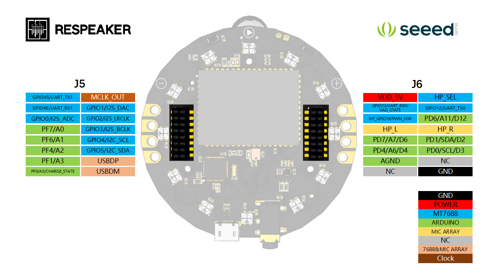

## Hardware

### Respeaker

USB cable pinout doc

| Pin | Name | Cable color | Description | ReSpeaker Pin |
|-----|------|-------------|-------------|---------------|
| 1   | VCC  | Red         | 5v input    | VDD_5V        |
| 2   | D-   | White       | Data -      | USBDM         |
| 3   | D+   | Green       | Data +      | USBDP         |
| 4   | GND  | Black       | Ground      | GND           |

