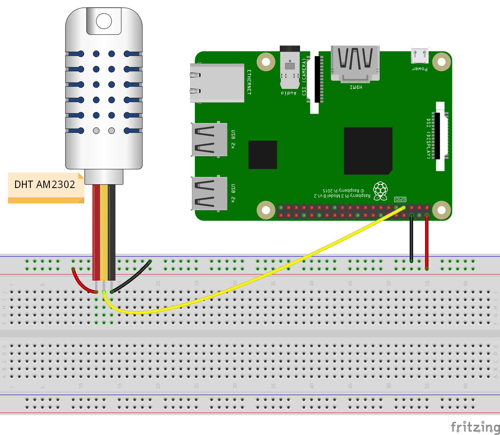

# Magic Mirror

- [Magic Mirror](#magic-mirror)
    - [Installation](#installation)
        - [Install desktop environment](#install-desktop-environment)
        - [Install MagicMirror app](#install-magicmirror-app)
        - [Disable the screensaver](#disable-the-screensaver)
        - [Auto starting MagicMirror](#auto-starting-magicmirror)
    - [Configuration](#configuration)
        - [Motion detection to turn on or off the screen](#motion-detection-to-turn-on-or-off-the-screen)
    - [Modules installation](#modules-installation)
        - [DHT sensor](#dht-sensor)
        - [MMM-PIR-Sensor](#mmm-pir-sensor)

## Installation

### Install desktop environment

Install Xserver, LXDE-gui and lightdm
```
sudo apt-get install xinit xserver-xorg lxde-core lightdm
```

Let the LXDE-gui autostart:
```
sudo raspi-config
```

Go to "Boot Options" and change boot to "Desktop" or "Desktop Autologin"

Install necessary packages
```
sudo apt-get install git libxss1 libnss3
```

Autohiding the Mouse Cursor with unclutter:
```
sudo apt-get install unclutter
```

Uninstall pulseaudio which has been installed durring the process. This last will break the audio configuration handled by Alsa.
```
sudo apt-get autoremove --purge pulseaudio
```

Reboot to take care of changes
```
sudo reboot
```

### Install MagicMirror app

Get and install MagicMirror with the Automatic Installer:
```
curl -sL https://raw.githubusercontent.com/MichMich/MagicMirror/master/installers/raspberry.sh | bash
```

Go to MagicMirror folder:
```
cd ~/MagicMirror
```

Install the app:
```
npm install
```

If you are directly on the Pi (not SSH), use the command bellow to test the Magic Mirror app.
```
npm start
```

If you are using SSH, use this command instead
```
DISPLAY=:0 nohup npm start &
```

### Disable the screensaver

Edit `/etc/xdg/lxsession/LXDE/autostart` and `.config/lxsession/LXDE/autostart`

Comment out or remove the line which concerne the screensaver:
```
@xscreensaver -no-splash
```

And add the following lines:
```
@xset s noblank @xset s off @xset -dpms
```

Edit `/etc/lightdm/lightdm.conf`. And add this in the section **[Seat:*]**:
```
xserver-command=X -s 0 -dpms
```

Reboot the RPi
```
sudo reboot
```

### Auto starting MagicMirror

Install PM2 using NPM:
```
sudo npm install -g pm2
```

Starting PM2 on Boot:
```
pm2 startup
```

PM2 will now show you a command you need to execute.

The command should be this one:
```
sudo su -c "env PATH=$PATH:/usr/bin pm2 startup linux -u pi --hp /home/pi"
```

## Configuration

### Motion detection to turn on or off the screen

Turn off
```
sudo tvservice -o
```

Turn on
```
sudo tvservice -p; sudo /bin/chvt 6; sudo /bin/chvt 7
```

## Modules installation

### DHT sensor

[This module](https://github.com/ryck/MMM-DHT-Sensor) gets data form DHT11, DHT22 and AM2302 sensors.

How to cable


Install first bcm2835 lib
```
cd ~
wget http://www.airspayce.com/mikem/bcm2835/bcm2835-1.52.tar.gz
tar zxvf bcm2835-1.52.tar.gz
cd bcm2835-1.52
./configure
make
sudo make check
sudo make install
```

Install the module
```
cd ~/MagicMirror/modules
git clone https://github.com/ryck/MMM-DHT-Sensor.git
cd MMM-DHT-Sensor
npm install
```

Configuration
```js
{
    module: "MMM-DHT-Sensor",
    position: "top_right",
    header: "Salon",
    config: {
        sensorPin: 17,
        sensorType: 22,
        updateInterval: 60 * 60 * 1000,
        initialLoadDelay: 0,
        animationSpeed: 1000,
        units: "metric",
        relativeScale: 35,
        debug: false
    }
}
```

Test manually the module.
```
DISPLAY=:0 npm start
```

If you get an error like the following (or your MagicMirror is just a black screen)
```
 WARNING! Could not load config file. Starting with default configuration. Error found: Error: Module version mismatch. Expected 50, got 48.
```

Then apply this
```
cd MMM-DHT-Sensor
npm install electron-rebuild
./node_modules/.bin/electron-rebuild
```

### MMM-PIR-Sensor

This module can monitor a PIR motion sensor and put your mirror to sleep.
Only need to follow [installation steps here](https://github.com/paviro/MMM-PIR-Sensor).

Configuration
```js
{
    module: 'MMM-PIR-Sensor',
    config: {
        sensorPIN: 22,
        powerSavingDelay: 20
}
```
